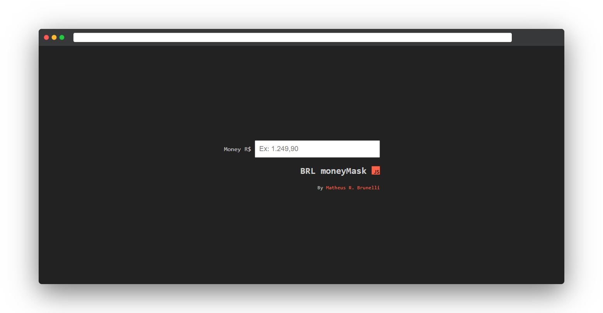

<div align="center">
    
    <br>
    <h1>BRL moneyMask</h1>
</div>

### :moneybag: Máscara para moeda
> Insere pontos e vírgulas automaticamente, seguindo o padrão do Real Brasileiro.

**Teste online agora:** [https://mrbrunelli.github.io/regexp-mask-money](https://mrbrunelli.github.io/regexp-mask-money)

#### Como usar
1. Clone o repositório
```bash
git clone https://github.com/mrbrunelli/regexp-mask-money
```
2. Adicione o script ```maskMoney.js``` ao projeto
```html
<script src="maskMoney.js">
```
3. Adicione a propriedade ```onkeyup``` chamando a função ```maskMoney()```, passando ```event``` como parâmetro
```html
<form method="post" action="/">
    <input type="text" name="nome">
    <input type="email" name="email">
    <input type="text" name="salario">
    <button type="submit">
</form>
```

#### Observação
Essa função está limitada até ```R$ 1.000.000,00```. Caso sua aplicação necessite de números maiores, é só adicionar na função, seguindo a lógica criada. Irei desenvolver uma versão utilizando o ```while```, para que não tenha limites.